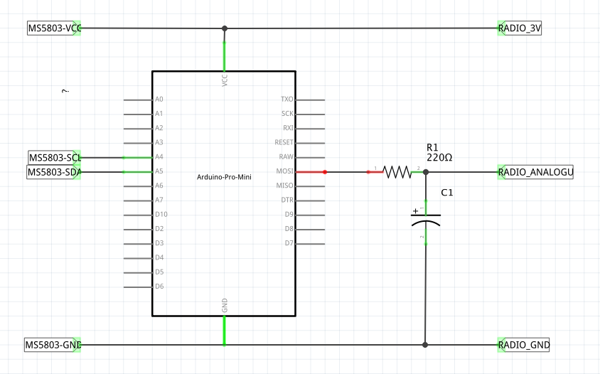

# sensor-adapter

An Arduino firmware to present pressure as an analogue voltage.

Used to connect MS5803 pressure sensor, via Arduino to Elsys ELT Lite LoRaWAN sensor.

# Building

    docker build -t sensor-adapter .
    make

Flash `artefacts/firmware.hex` to your device.

# Elsys configuration

Using the Elsys "Sensor Settings" app, set:

 - External configuration: "Analog input 0-10V"
 - Sensor sample times: "External startup time" "2000mS"

# Wiring

Use a 10uF capacitor and 220 ohm resistor.

On the Elsys device:

 - Connect RADIO_3V to B+
 - Connect RADIO_GND to GND
 - Connect RADIO_ANALOGUE to IN

# Principle of operation

When the Elsys LoRaWAN sensor takes a reading, it powers up the Arduino for 2 seconds.

The Arduino reads the MS5803 pressure sensor over i2c and generates a PWM output on pin 11 according to the pressure level. The RC filter smooths the PWM into an analogue voltage.

The Elsys LoRaWAN sensors reads the analogue voltage, cuts power to the Arduino then transmits the value across the network.
